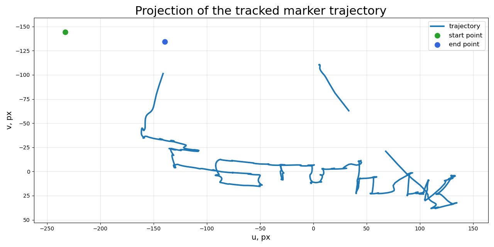
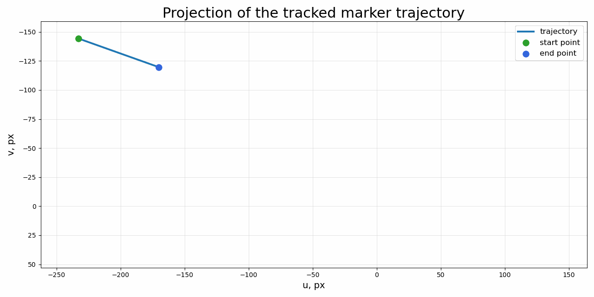

@"
# Exam 2

This folder contains the solution and visualization results for Exam 2.

## Files

- `visualize_writing.py` — Python script for detecting and visualizing the ArUco marker trajectory.
- `IMG_2702.MOV` — original input video.
- `aruco_marker_0_1.5cm.png` — ArUco marker used for tracking.
- `exam_traj_2.mp4` — processed video with the marker trajectory.
- `preview.png` — final trajectory visualization.
- `preview.gif` — animated preview of the result.
- `analysis/result.png` — saved result image.
- `analysis/result.gif` — saved animated result.

## Result preview

## Animated preview

"@ | Set-Content .\Exam_2\README.md